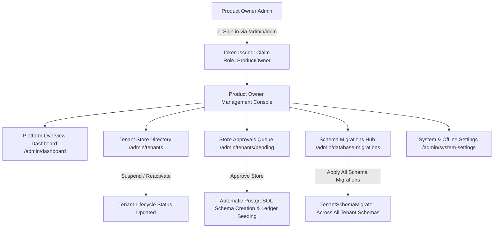
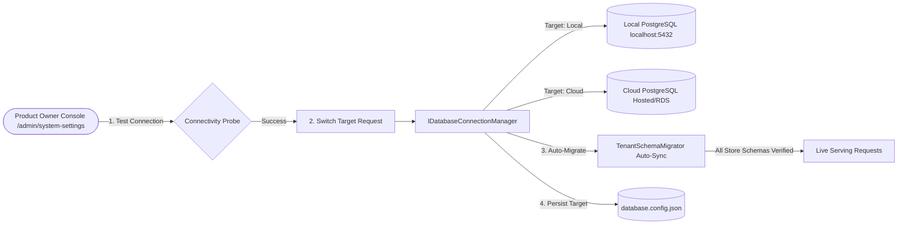
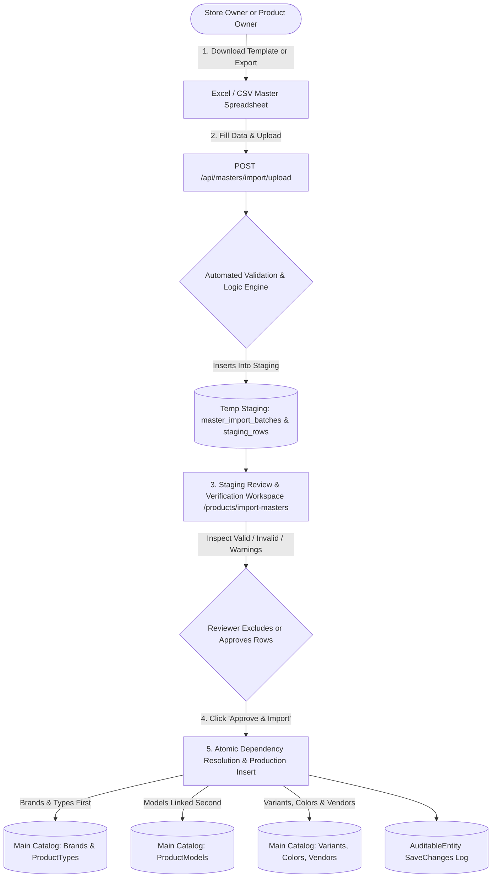

# Accounting & Inventory User Manual

Version: 1.7 | Updated: 10 October 2026 | Covers modern multi-line billing, automated Indian GST, FIFO payments, Party Statements, Business Intelligence, Smart Suggestions, Multi-Cloud Database Switching, and Two-Stage Master Data Import & Verification

For business owners, purchase staff, sales staff and accountants. Menu names below match the application. Your owner provides your website address and Tenant slug. Available actions depend on your permissions.

To share this guide, send accounting-user-manual.html. Open that file in a browser and choose Print / Save PDF for a paper or PDF copy. Keep the version and date with any distributed copy.

## Contents

- [1. Get started](#1-get-started)
- [2. Owner: invite staff and grant access](#2-owner-invite-staff-and-grant-access)
- [3. Set up products and bill details](#3-set-up-products-and-bill-details)
- [4. Accountant: bring forward opening balances](#4-accountant-bring-forward-opening-balances)
- [5. Record a new purchase](#5-record-a-new-purchase)
- [6. Pay a supplier](#6-pay-a-supplier)
- [7. Create a sale and select GST](#7-create-a-sale-and-select-gst)
- [8. Receive a customer payment and print a bill](#8-receive-a-customer-payment-and-print-a-bill)
- [9. Return or cancel a sale](#9-return-or-cancel-a-sale)
- [10. Return a product to a supplier](#10-return-a-product-to-a-supplier)
- [11. Record refunds and print notes](#11-record-refunds-and-print-notes)
- [12. Check balances, GST and stock](#12-check-balances-gst-and-stock)
- [13. Accountant: journals, periods and bank reconciliation](#13-accountant-journals-periods-and-bank-reconciliation)
- [14. Additional accounting controls](#14-additional-accounting-controls)
- [15. Daily checklist and practice example](#15-daily-checklist-and-practice-example)
- [16. Common problems and help](#16-common-problems-and-help)
- [17. Terms used in this guide](#17-terms-used-in-this-guide)
- [18. Multi-line invoices and customer advances](#18-multi-line-invoices-and-customer-advances)
- [19. Stocked accessories and integrity controls](#19-stocked-accessories-and-integrity-controls)
- [20. Non-Accountant Store Operator Guide & Smart Suggestions](#20-non-accountant-store-operator-guide--smart-suggestions)
- [21. Tenant Onboarding & Offline Deployment Setup Guide](#21-tenant-onboarding--offline-deployment-setup-guide)
- [22. Product Owner (Super Administrator) Console & Platform Management](#22-product-owner-super-administrator-console--platform-management)
  - [22.1 Dedicated Product Owner Sign In](#221-dedicated-product-owner-sign-in)
  - [22.2 Platform Overview Dashboard](#222-platform-overview-dashboard-admindashboard)
  - [22.3 Tenant Directory & Store Approvals](#223-tenant-directory--store-approvals-admintenants)
  - [22.4 Database Schema Migrations Hub](#224-database-schema-migrations-hub-admindatabase-migrations)
  - [22.5 System Settings & Offline Configuration](#225-system-settings--offline-configuration-adminsystem-settings)
  - [22.6 Dynamic Database Switching (Local PostgreSQL ↔ Cloud PostgreSQL)](#226-dynamic-database-switching-local-postgresql--cloud-postgresql)
- [23. Master Data Import & Staging Verification (Vendors, Brands, Categories, Models, Variants, Colors)](#23-master-data-import--staging-verification-vendors-brands-categories-models-variants-colors)
## 1. Get started

1. For a new account, open the invitation email and follow the activation link. Invitations expire after 24 hours and can be used once.
2. Set a password containing at least 12 characters, including an uppercase letter, a lowercase letter and a number.
3. Open the sign-in page. Enter your Tenant slug, Username and Password, then sign in.
4. Expand the sidebar sections to find Product, Purchase, Sale, Accounting and Settings.
5. Ask the owner for the permissions needed for your work. Activation alone does not give staff permission to enter transactions.

Expected result: you can sign in to your own business and open the permitted forms. If you see a permission error, follow section 16.

## 2. Owner: invite staff and grant access

1. Open Accounting > Staff Access. This page is available to the designated owner.
2. Enter Username, Email and Mobile, then select Send invitation.
3. Ask the staff member to activate the email invitation. Until activation, their status is Invited and they cannot sign in.
4. When the user is Active, tick the permissions they need in their row. Changes save as you select them.
5. Ask the user to refresh the application before retrying a blocked action.

| Permission shown on screen | Use |
| --- | --- |
| catalog.manage | Maintain product references, customers and settings |
| purchases.manage | Enter purchases, supplier payments, purchase returns and supplier refunds |
| sales.manage | Enter sales, customer receipts, sales returns and customer refunds |
| inventory.manage | Authorized inventory adjustments |
| accounting.manage | Opening balances, journals and general accounting actions |
| accounting.approve | Review accounting approval requests |
| accounting.dimensions.manage | Maintain branches, projects and cost centers |
| accounting.documents.manage | Link supporting evidence |
| accounting.assets.manage | Maintain fixed assets |
| accounting.budgets.manage | Maintain budgets |

To resend an unused or expired invitation, select Resend invitation. The recipient should use the latest email. To suspend verified staff, select Disable; select Enable to restore their account. Disabling does not erase historical transactions.

To change the owner, first confirm that the replacement user is active and verified. Select Transfer ownership in their row and confirm the named user. You immediately lose owner privileges; you retain only separately granted staff permissions. Arrange any access you need before transferring ownership.

The initial owner receives an invitation from the service administrator. Contact that administrator if your business has no activated owner.

## 3. Set up products and bill details

1. Under Product, add Vendors, Brands, Product Types, Categories / Models, Variants and Colors as needed. Create the brand and product type before their model.
2. Under Settings > Tax, maintain the CGST/SGST rate combinations used by your business. Have your accountant confirm which rate to apply.
3. Under Settings > Customer Bill, enter the seller details and choose the printing options for new invoices.
4. Confirm that the model belongs to the selected brand and product type before recording stock.

Expected result: purchase forms offer the required references and sale forms offer the required GST rates. Changes to customer, supplier, product or seller details do not rewrite details captured on existing invoices. Older invoices may use explicitly reconstructed details from the upgrade.

## 4. Accountant: bring forward opening balances

Use this once when starting the business in this system with existing stock and unpaid customer/supplier invoices. For a business starting without historical balances, ask your accountant whether an opening import is needed. Complete the cutover before entering normal transactions. Normal postings must be dated after the cutover date.

### Prepare and stage stock

1. Agree a cutover date with the owner and prepare the approved balance-sheet totals, unpaid invoices and stock list as of that date.
2. Create the customer, vendor and product references needed by those lists.
3. Open Accounting > Opening Balances & Reconciliation and select the cutover date.
4. Select Initialize accounts if the standard accounts have not been created.
5. Select Import opening stock. Enter one existing unit, its serial number, historical purchase details and historical cost, then select Import stock unit.
6. Repeat for each unit. Use a purchase date on or before cutover. Staged units remain unavailable for sale until opening balances are posted.

### Enter and post balances

1. On Opening Balances & Reconciliation, enter each balance-sheet account with a debit or credit. Select Add account balance for more lines.
2. Select Add outstanding item for each unpaid customer or vendor invoice. Choose Customer or Vendor, Party, invoice reference, Due date and Opening amount.
3. Check that customer items equal the debit balance on 1100 (receivables), vendor items equal the credit balance on 2000 (payables), and staged stock net costs equal the debit balance on 1200 (inventory).
4. Include the other approved balance-sheet balances. The system posts any remaining difference to retained earnings; the accountant must approve that difference before submission.
5. Review every line and select Post reconciled opening balances.
6. Confirm that stock is available and that the Receivables, Payables and Stock reconciliation differences are all zero.

Example: customer items total 200, vendor items total 150 and stock net cost totals 100. The corresponding control lines are 1100 debit 200, 2000 credit 150 and 1200 debit 100. With no other lines, the system balances the remaining 150 to retained earnings. Use your accountant's complete figures for a real import.

Expected result: one opening journal, individual outstanding items and active opening stock. The import cannot be repeated. Use this dedicated page when importing party or stock balances; the older General Ledger opening form does not collect those detailed items.

### Settle an old unpaid invoice

1. Find the item under Opening outstanding items.
2. Select Receive payment for a customer or Pay vendor for a supplier.
3. Enter a date after cutover, an amount no greater than the outstanding balance, and Cash or Bank.
4. Select Save settlement and verify the reduced balance.

Use this workflow for brought-forward invoices. Opening stock does not create a new supplier bill or new input GST claim in the normal purchase workflow.

## 5. Record a new purchase

1. Open Purchase > Products and choose the add action.
2. Select Vendor and enter Vendor Bill / Invoice Number, Vendor Invoice Date and Payment Terms (days).
3. Select Brand, Product Type, Model, Variant and Color.
4. Enter the unit's Serial Number and Serial Number 1 where applicable. Check both against the physical unit.
5. Enter Purchase Price before GST, Discount before GST, CGST (%) and SGST (%). Check the calculated Total Amount (per unit).
6. Save and verify that the unit appears in Purchase > Stock Inventory and the bill appears in Purchase > Bills & Payments.
7. For multiple serialized units on one vendor invoice, enter each unit using the same vendor, bill number, invoice date and payment terms. Finish entering the invoice before paying it.

Example: Purchase Price 1,000, Discount 0, CGST 9% and SGST 9% gives Total Amount 1,180 per unit.

Expected result: available stock and a supplier payable are created. Saving a purchase does not record payment. Serial numbers cannot collide with existing records. Paid bills cannot gain or change units; posted, sold or written-off stock cannot be edited directly.

## 6. Pay a supplier

1. Open Purchase > Bills & Payments and find the vendor bill.
2. Select View / Record in the Payments column.
3. Review the invoice total, previous payments and balance.
4. Enter Amount, Payment method and Payment date. Enter the required reference for a transfer, UPI or cheque, and an optional note.
5. Select Record payment once, then check Payment history and the remaining balance.

Expected result: the supplier balance decreases. The amount cannot exceed the outstanding bill balance and the date cannot precede the invoice or fall in a closed period. Opening invoices are settled through section 4.

## 7. Create a sale and select GST

1. Open Sale > Products and choose the add action.
2. Select Product (name or serial number). Match the displayed serial to the physical unit.
3. Check Purchase Price (including GST), which fills automatically and cannot be edited here.
4. Check GST rate. It defaults to the configured CGST/SGST combination matching the purchase product. Verify it before saving; if a matching rate is missing, ask the owner to configure it under Settings > Tax.
5. Enter Selling Price (including GST). It initially equals the product's purchase total, and you can change it.
6. Check Discount (including GST), calculated as purchase total minus selling price, with a minimum of zero. It is not an additional discount to subtract from the selling price.
7. Search Customer Name or Mobile and select an existing customer, or enter the customer's details. Confirm Mobile Number and Address; Email is optional.
8. Enter Sale Date and Payment Terms (days), then select Create Sale.
9. Verify the invoice under Sale > Bills & Payments. Record any money received separately using section 8.

Example: purchase total 1,180 and selling price 1,000 gives a displayed discount of 180. With CGST 9% and SGST 9%, the selling total remains 1,000; the system calculates the taxable value and tax inside that total. A selling price above 1,180 gives a displayed discount of zero.

GST rate selection is required by the form. No GST is an available selection; use it only when appropriate for the transaction. Selecting a product again can reset its default selling price and GST selection, so review those fields after changing products.

Expected result: the unit becomes sold and a customer receivable is created. The sale date cannot precede purchase, cutover or the previous customer return for a restocked unit. Posted financial details cannot be changed directly; use Returns & Corrections for supported full-unit corrections.

## 8. Receive a customer payment and print a bill

1. Open Sale > Bills & Payments and find the invoice.
2. Select View / Record in the Payments column.
3. Check Bill Total, Received and Balance Due.
4. Enter Amount, Payment method, Payment date and any required transaction reference. Add an optional note.
5. Select Record payment, then confirm the receipt in Payment history and the reduced balance.
6. Select Print bill. Review the invoice and use the print control to print or save it as a PDF.

Expected result: the customer's outstanding balance decreases. Receipts cannot exceed the unpaid amount or precede the invoice. New invoice prints retain the seller and customer/product details captured at creation, while payment history reflects subsequently recorded payments.

## 9. Return or cancel a sale

This workflow reverses a complete serialized unit. The original invoice stays in history. A refund is a separate step.

1. Open Accounting > Returns & Corrections and set Invoice type to Sale.
2. Search Find invoice or serial, then select the correct Invoice unit.
3. Enter Note date on or after the sale and all receipts already recorded for it, in an open period after cutover.
4. For Returned stock, choose Restock for resale if the unit is saleable, or Write off damaged stock if it must not be sold again.
5. Enter a clear Reason, review the invoice/serial and select Post credit note.
6. Confirm the note in the table. Check Stock Inventory or Stock Movements for the selected disposition.
7. If money must be returned to the customer, follow section 11.

Expected result: the sale and GST journal are reversed. Restock makes the unit available for a later sale. WriteOff removes its inventory cost and records the loss. The same sale cannot be returned twice and cannot receive further payments after return.

To cancel an entered sale or replace incorrect invoice details, first confirm that a full reversal is appropriate, post the credit note, then create the replacement sale from available stock. A partial price-only adjustment is not currently supported.

## 10. Return a product to a supplier

1. Open Accounting > Returns & Corrections and set Invoice type to Purchase.
2. Search the bill or serial and select the available Invoice unit.
3. Enter Note date on or after purchase. If it was sold and later returned by a customer, the supplier return must also be on or after that customer return.
4. Enter the supplier-return Reason and select Post debit note.
5. Confirm the note and that the unit is no longer available stock.
6. Record any refund received from the supplier using section 11.

Expected result: the unit's original purchase journal and GST are reversed. Sold or inactive stock cannot be returned through this form. The debit note reduces the supplier bill's payable; a supplier refund can only use the paid credit available after the other units on that bill are accounted for.

## 11. Record refunds and print notes

1. In Accounting > Returns & Corrections, find the posted note.
2. If Record refund is available, select it. The form shows the available paid credit.
3. Enter Date on or after the note, Amount within that available credit, Cash or Bank, and Reference where available.
4. Select Save refund and verify the Refunded value. Record the actual cash/bank movement once.
5. Select View note to review the original party, product/serial, reason, tax reversals and refund history.
6. Select Print / save PDF to produce a copy for the customer or supplier.

Expected result: customer refunds record money paid out; supplier refunds record money received. An unpaid returned invoice may have no refund available. Never enter a refund as a new customer receipt or vendor payment. Notes cannot be edited after posting; contact the accountant if a note was entered incorrectly.

## 12. Check balances, GST and stock

1. Open Accounting > Opening Balances & Reconciliation and set Cutover / report date to the date you want to review.
2. Compare Subledger and GL for Receivables, Payables and Stock. Each Difference should be zero. Refer any difference to the accountant with the date and relevant invoices.
3. Open Accounting > Receivable & Payable Aging to review overdue customer and supplier amounts for the selected report date.
4. Open Accounting > GST Reports and select the reporting dates. Review sales tax, purchase input tax and their ledger comparisons. Return notes reduce tax in their note period. Opening stock is excluded from new purchase input-tax reporting.
5. Open Accounting > Stock Movements to trace purchases, sales, customer returns, supplier returns and write-offs by date.
6. Use Purchase > Stock Inventory to review current availability, and the Bills & Payments pages for current invoice balances.

These reports support checking the recorded transactions. Have the accountant review the figures and required supporting records before preparing external returns or statements.

## 13. Accountant: journals, periods and bank reconciliation

### Manual journals

1. Open Accounting > General Ledger and review the Chart of Accounts.
2. Under Post Journal, enter Journal date and Description.
3. Add account lines with the approved debit or credit amounts and dimensions where needed.
4. Check that total debits equal total credits, then post using the form's submit button.
5. Verify the entry in the journal listing and review the affected reports.

Purchase, sale, receipt, payment and return workflows create their own journals. Enter those transactions in their dedicated screens to keep stock and unpaid invoice balances consistent. An accountant should review any manual posting to control accounts.

### Accounting periods

1. Open Accounting > Accounting Periods, enter Period name, Start date and End date, then select Create period.
2. Review completed transactions, bank matching, GST and control-account differences for the period.
3. Select Year-end close only after the accountant confirms the period is ready for that closing. This closes revenue and expense balances to retained earnings as well as locking the dates; confirm the prompt after reviewing its period name and date range.
4. If a closed-period transaction needs attention, ask the accountant to review how to correct it. The current screen does not provide a reopen button.

Expected result: closed periods reject postings. Backdating a transaction will not bypass this control.

### Bank reconciliation

1. Open Accounting > Bank Reconciliation and choose the bank ledger account.
2. Enter the statement reference, date range, opening balance and closing balance.
3. Add statement lines with date, description, reference and signed amount: positive for money in, negative for money out.
4. Select Import statement, then select the statement under Reconciliation.
5. Match each statement line to the correct available ledger line after checking amount and direction. Investigate unmatched items.
6. When every line is matched and the statement balances agree, select Finalize.

Matching associates existing entries; it does not replace recording a missing receipt, payment or accountant-approved bank adjustment. Check whether a statement has already been imported before importing it again.

## 14. Additional accounting controls

These tasks require the corresponding permission. Open Accounting > Controls & Budgets.

- Approvals: enter the Action, Resource ID, Summary and the exact action payload supplied by your accountant or administrator, then Submit for review. A different authorized user reviews with Approve or Reject; an approved request is executed using Apply. Approval alone does not apply the action.
- Supporting documents: enter the resource type/ID, File name, Content type, Storage reference and optional Description, then Link evidence. Store the document in the agreed document store first; this form links the reference rather than uploading the file.
- Reporting dimensions: choose Type, enter Code and Name, then Add dimension. Use the agreed branch, project or cost-center codes.
- Fixed assets: enter acquisition details, cost, salvage value, useful life and the accountant-approved accounts, then Record asset. Use Depreciate month or Dispose only after reviewing the dates, prior depreciation and disposal proceeds with the accountant.
- Budgets: select Account and optional Dimension, enter Budget amount, Start date, End date and Notes, then Save budget. Review Actual and Variance for the same period.

## 15. Daily checklist and practice example

### Daily checks

1. Match received and sold units to their serial numbers.
2. Check that invoices and actual payments have both been recorded where appropriate.
3. Review payment references and cash/bank totals against the day's evidence.
4. Review returns and refunds separately; confirm the physical stock disposition.
5. Review outstanding balances and reconcile control differences with the accountant.
6. Keep invoice, payment and return documents in the agreed location, and sign out when finished.

### Practice in a training business

1. Enter one purchased unit at 1,000 before GST with CGST 9% and SGST 9%; confirm purchase total 1,180.
2. Record supplier payment 1,180; confirm no supplier balance remains.
3. Sell the unit for 1,000 including GST; confirm displayed discount 180.
4. Record customer payment 1,000; confirm Balance Due is zero and print the bill.
5. Return the sale using Restock; confirm a credit note and available stock.
6. Refund the customer 1,000; confirm the refund history on the printable note.
7. Confirm receivables, payables and stock reconcile for the final report date. A restocked unit remains at its original net inventory cost.

Use a training business for this exercise; each saved step creates real accounting records within the selected business.

## 16. Common problems and help

| Message or symptom | What to do |
| --- | --- |
| sales.manage permission required | Owner opens Staff Access and grants sales.manage to the active user; refresh and retry |
| Other permission required | Send the exact code to the owner and request the access needed for your role |
| Activation link expired or already used | Ask the owner to resend if still unverified; use the latest email. An already activated user should sign in |
| Staff Access is missing | This menu is restricted to the designated owner |
| Product not available for sale | Check it is active, unsold and not staged opening stock awaiting cutover |
| Wrong or missing default GST rate | Verify purchase rates and ask the owner to configure the matching combination; review the sale before saving |
| Duplicate serial number | Check both serial fields and existing stock history; confirm the physical serial before retrying |
| Payment exceeds outstanding balance | Review previous payments and returns; enter only the remaining amount |
| Refund exceeds available paid credit | Review the original payments and prior refunds; for supplier bills, review the remaining invoice units |
| Closed accounting period | Ask the accountant to review the date and correction process; the current period screen does not provide reopening |
| Posting date at/before cutover | Use the actual operational date after cutover; settle old invoices through Opening outstanding items |
| Opening totals do not match | Reconcile detailed customer/vendor items and stock costs to 1100/2000/1200 before posting |
| Opening import already exists | Do not repeat the import; ask the accountant to review existing opening records |
| Legacy invoice has no source journal | Ask the accountant/administrator to reconcile the historical invoice before returning it |
| Reconstructed details on an old note | Review against the original paper invoice; details available at upgrade cannot establish earlier master-data changes |
| A posted record cannot be edited | Use the supported full-unit return workflow when appropriate, or ask the accountant to review |
| Failed request or connection error | Check whether the record was saved before retrying; refresh its listing/history to avoid duplicate entry |

For help, provide the page name, exact message, invoice/note number, serial number, transaction date and steps taken. Share screenshots with customer details concealed where appropriate. Never share passwords or invitation tokens.

## 17. Terms used in this guide

| Term | Meaning |
| --- | --- |
| Tenant | Your business's separate application workspace |
| Serialized unit | One stock item identified by its serial number |
| GST-inclusive price | The final amount including CGST and SGST |
| Receivable | Money a customer still owes the business |
| Payable | Money the business still owes a supplier |
| Credit/debit note | A linked document reversing a supported invoice unit |
| Refund | Actual money returned after a note; separate from posting the note |
| Restock | Make a customer-returned unit available for resale |
| Write-off | Remove stock value because the unit is no longer saleable |
| Cutover | The date used to bring historical balances into the system |
| Subledger | Detailed customer, supplier or stock balances |
| GL | General Ledger, containing the accounting entries |
| Reconciliation | Comparing detailed balances with their corresponding ledger totals |

Current scope: full serialized-unit and whole multi-line invoice returns and cancellations. Partial invoice returns and partial price adjustments are not available.

## 18. Multi-line invoices and customer advances

Prerequisites: sales permission, available serialized stock where applicable, configured seller bill details and active tax rates. GST-registered sellers must provide their state, the place of supply and a valid HSN/SAC code for each line.

1. Open Sale > Invoices and create a new invoice. Select the customer and check the contact details, GSTIN and place of supply.
2. Add serialized products, standard items or services. A serialized product can appear once with quantity 1. Accessory and service quantities support four decimal places. Accessory lines require a stocked SKU and deduct quantity and inventory cost; service lines do not affect stock.
3. Enter the tax-exclusive unit price, discount, HSN/SAC and unit of measure (for example NOS). Select an active tax rate. The seller state and place of supply determine CGST/SGST or IGST. Check the displayed totals before saving.
4. If collecting an initial payment, enter its amount, method and date. Money supports two decimal places. Non-cash payments require a reference, except the Other method. Payments cannot predate the invoice.
5. Save and print the invoice. Printed buyer, seller, serial numbers, HSN/SAC and amounts come from the saved invoice snapshot, even after master details change.

To receive a payment across invoices, open the customer payment dialog from the invoice list. Select the customer, amount, method, date and reference. Use Auto-Allocate FIFO (Oldest First) or enter custom allocations. Custom allocations cannot exceed the payment or an invoice balance. The unallocated amount becomes an on-account advance for that customer.

To use an advance, select it under Existing customer advances, select an unpaid invoice, enter the amount and date, then choose Apply advance. This settles the invoice without recording cash a second time. To return unused credit, select the advance, enter an amount, refund date, Cash or Bank and the bank reference if applicable, then choose Refund advance. An advance cannot be applied to another customer, spent twice or refunded above its remaining amount. Application and refund dates cannot predate the original advance.

For a whole invoice return, open Accounting > Returns & Corrections, select the invoice, date and reason, then choose whether serialized stock is restocked or written off. All invoice lines are reversed together. Record any customer refund separately, limited to credit already paid. The cancelled invoice remains available in history and cannot receive new payments. Partial line returns require a separately scoped workflow.

Use customer statements and aging with an as-of date to check historical balances. Returns, receipts and refunds affect the report on their own dates; later cancellations do not erase an earlier outstanding balance. GST reports include original invoices and dated reversals, including IGST and mixed tax rates. Customer history opens each invoice using its corresponding bill page. Legacy single-product bills retain their existing payment workflow.

If a payment request loses its response, repeat the same action in the same browser session with unchanged details. The saved retry key allows the API to return the committed result without posting twice. Changing details creates a different request; first check invoice or customer history when uncertain whether an earlier transaction succeeded.

## 19. Stocked accessories and integrity controls

Prerequisites: create active suppliers and GST rates. SKU creation requires catalog permission; purchases and supplier returns require purchase permission; write-offs require inventory permission; opening stock requires accounting permission. Multi-line sales require sales permission.

1. Open Purchase > Stock Movements and find Accessory SKU inventory. Enter a unique SKU code, accessory name, HSN and unit (such as NOS), then choose Create SKU.
2. To enter a purchase, select the SKU and supplier, supplier bill number, stock date, quantity, tax-exclusive unit cost and payment terms. Select GST and tick Interstate purchase (IGST) only when appropriate for that supplier invoice. Choose Receive stock.
3. The stock quantity and carrying value increase. The supplier bill appears in Purchase accounting, with its payable and GST recorded. Use the existing supplier payment page to pay it. All items on a supplier bill must use the same invoice date and payment terms. After payments or returns are recorded, enter further stock under a separate bill.
4. To sell an accessory, add an item to a multi-line sales invoice, keep the line type Accessory, select its SKU and enter selling price, quantity and tax. Saving deducts stock and posts cost of goods sold. Select Service for a non-stock charge.
5. A whole customer invoice return restores the original sold quantity and cost when Restock is chosen. WriteOff returns reverse the sale and expense the returned cost without making those items available again.
6. To return purchased accessories, select the whole purchase receipt under Accessory supplier return, enter the date and reason and choose Return receipt to supplier. Available quantity must cover the receipt quantity. The credit reverses the original supplier amount and GST; any difference between original purchase cost and current carrying cost is posted as a cost variance. Record supplier refunds through Returns & Corrections.
7. To remove damaged or missing accessories, select the SKU, date, quantity and reason, then choose Write off quantity. Check the stock movement ledger and reconciliation report afterwards.

Accessory costs use moving average. A sale or write-off consumes the proportionate carrying value, rounded to two decimals; issuing the final quantity consumes the exact remaining value. Customer returns restore the recorded original sale cost. Enter all movements in chronological order: dates cannot precede the latest movement for that SKU, and quantities cannot reduce stock below zero. Whole receipt and whole invoice returns are supported; partial returns, warehouse transfers and batch/expiry tracking require separately scoped workflows.

For stock already held at cutover, create a new SKU and use Stage opening SKU stock before importing the opening journal. Enter the opening date, quantity and carrying unit cost. Staged stock is unavailable for sale or write-off. Include its value, together with serialized stock cost, in account 1200 in Opening Balances. The opening import checks the total and activates staged SKU stock. Opening stock is excluded from new supplier purchases and input GST reports; bring forward any supplier outstanding amounts using opening vendor items.

Serialized write-offs must be dated on/after purchase and the customer return that restored the unit. Ordinary manual journals cannot post to accounts 1100, 1200 or 2000. Use customer, supplier or inventory workflows; historical ledger adjustments require an approved FinancialCorrection request and reconciliation review.

Customer history now shows Net received: cash and bank receipts plus original advances, less customer and advance refunds. Applying an advance is not counted again as new money. Individual invoice payment histories still show the applied credit.

For GST invoices, save Home State (GST) in Settings > Customer Bill, then choose Place of Supply (State) on the invoice. Missing supplier settings are displayed explicitly rather than defaulting to Maharashtra.

## 20. Non-Accountant Store Operator Guide & Smart Suggestions

Designed for store owners, retail sales staff, and cashiers who do not possess formal bookkeeping or accounting training. This system automates double-entry accounting, Indian GST rate determinations, stock relieving, and ledger reconciliations behind the scenes while presenting an intuitive, self-explanatory retail interface.

### 20.1 Zero-accounting automation: what happens behind the scenes

In traditional software such as Tally Prime, operators must manually select voucher types (F4 Contra, F5 Payment, F6 Receipt, F7 Journal, F8 Sales, F9 Purchase), specify debit and credit account ledgers, and compute tax splits. In this system, all of that bookkeeping is completely automated:

1. **Instant Sales Invoicing**: Creating an invoice automatically posts `Accounts Receivable (1100)` and `Sales Revenue (4000)`.
2. **Automated Indian GST**: Automatically calculates and separates tax into `CGST (2100)` and `SGST (2100)` for local sales, or `IGST (2100)` for interstate sales based on Place of Supply.
3. **Automated Stock Deduction & Costing**: Adding a serialized phone or stocked accessory automatically relieves `Inventory (1200)` and posts `Cost of Goods Sold (5000)` using real-time FIFO and moving average costs.
4. **Receipts & Ledgers**: Payments automatically update Cash/Bank balances and reconcile customer balances in real time.

### 20.2 Smart billing assistant & proactive customer suggestions (`Sale > Invoices`)

When entering a new multi-line sales invoice, the interface provides intelligent assistive cards and one-click shortcuts:

- **💡 Plain-English Billing Assistant**: Click **"💡 How It Works (Quick Tour)"** at the top of the invoice form at any time for an on-screen visual summary of customer balance checks, IMEI locking, GST splits, and payment entries.
- **Proactive Customer Dues & Advance Suggestions**:
  - As soon as you select a customer by typing their name or mobile number, the system automatically checks their historical account balance in the background.
  - If the customer has unpaid bills from earlier purchases, a yellow suggestion banner alerts you immediately:
    > **💡 Smart Suggestion:** Customer has ₹X unpaid balance across Y past bills. Consider collecting old dues together with this bill.
  - If the customer holds unused advance store credit, a green suggestion banner informs you:
    > **✨ Advance Credit Available:** Customer has ₹X in store credit. Can be applied to settle bills in Multi-Pay.
- **1-Click Smart Payment Shortcuts**:
  - Instead of manually checking boxes and typing exact rupee amounts, select any of the one-click preset buttons:
    - **💵 Full Cash**: Instantly marks the invoice as collected in full and sets payment mode to Cash.
    - **📱 Full UPI / QR**: Automatically fills the exact bill total and sets payment mode to UPI (GPay / PhonePe / Paytm).
    - **💳 Card Swipe**: Automatically fills the exact bill total and sets payment mode to Card.
    - **⏳ Pay Later (Credit Bill)**: Marks the bill as sold on credit (₹0 paid today); the invoice balance is automatically logged to the customer's ledger for follow-up.
- **Quick-Add Stocked Accessories**:
  - If your shop has stocked accessories (screen guards, back covers, chargers), 1-click suggestion chips appear above the items table to add them instantly with stock availability counts.
- **Automatic Indian Place of Supply & GST Split**:
  - The system checks your shop's registered state against the customer's state code.
  - **Local Sale (Intra-State)**: Applies a 50/50 split between CGST and SGST.
  - **Inter-State Sale**: Automatically applies 100% IGST.
  - A color-coded status badge confirms the tax mode so you never need to calculate tax percentages by hand.
- **High-Speed Keyboard Entry (Tally-Speed Hotkeys)**:
  - `Alt+N`: Quickly add a new serialized phone to the invoice.
  - `Alt+A`: Quickly add an accessory line.
  - `Ctrl+Enter` or `Alt+S`: Instantly save, post, and open the printable tax invoice.
  - `Esc`: Cancel and return to the invoices list.

### 20.3 Smart multi-invoice payment allocation (`Sale > Invoices > Smart Multi-Pay`)

When a customer pays a lumpsum amount (for example ₹10,000) against multiple past unpaid bills:

1. Open **Smart Multi-Pay** (`Alt+M` or select **Smart Multi-Pay** from the invoice list).
2. Select the customer from the dropdown. The system automatically lists all unpaid bills in chronological order (oldest to newest) with total balance due.
3. Use the **💡 Smart Suggested Payment Amounts**:
   - `Clear All Dues`: Automatically fills the exact total outstanding balance.
   - `Pay Half`: Fills 50% of the customer's total due.
   - `Round Figure`: Rounds up to the nearest ₹1,000.
4. **Auto-Allocate FIFO (Oldest First)**:
   - Keep FIFO selected. The system automatically settles the customer's oldest bills first.
   - If the customer pays more than their total outstanding balance, the excess amount is **safely saved as an Advance Store Credit** on their account for future visits.
   - A live green badge shows the exact settlement preview: *"Will clear X bills in full and partially pay 1 bill. + ₹Y saved safely as Customer Advance."*

### 20.4 Understanding customer and vendor ledgers (`Accounting > Party Statement`)

To check a complete history of transactions for any customer or supplier without accounting confusion:

- Open **Accounting > Party Statement** (`Alt+P`).
- Click **"💡 How to Read Ledgers"** at any time to view the plain-English explanation:
  - **Customer Statement**:
    - **Debit (+)**: Phones or accessories you sold to the customer on bill.
    - **Credit (-)**: Payments received from the customer (Cash, UPI, Card).
    - **Closing Balance Dr**: Money the customer still owes your shop today.
    - **Closing Balance Cr**: Advance store credit the customer has with you.
  - **Vendor Statement**:
    - **Credit (+)**: Inventory you purchased from the supplier.
    - **Debit (-)**: Payments you sent to the supplier.
    - **Closing Balance Cr**: Money you still owe the supplier.
    - **Closing Balance Dr**: Advance money you gave the supplier.
- **Color-Coded Aging & Overdue Insights**:
  - **0–30 Days (Green)**: Fresh, normal billing cycle.
  - **31–60 Days (Blue)**: Maturing bills; time to send a friendly reminder.
  - **61–90 Days (Amber)**: Overdue; phone call follow-up recommended.
  - **90+ Days (Rose)**: Critical overdue; prioritize recovery before issuing further credit.
- **Smart Next Action Suggestions**:
  - If a customer has a pending balance, an immediate 1-click **"Collect Payment via Multi-Pay"** button is displayed.
  - If all bills are settled, an **"All Settled (Zero Balance)"** badge confirms that the account is fully clear.
- **Export & Print**:
  - Export the full chronological ledger to Excel/CSV with running balances.
  - Print a formal stationery Statement of Account for customer sharing with your shop logo, GSTIN, and contact details.

### 20.5 Daily operations from the Business Intelligence Dashboard (`Dashboard / Home`)

The real-time BI Dashboard gives shop owners a complete financial and operational overview:

- **Executive KPI Cards (Plain-English Meanings)**:
  - **Monthly Revenue**: Total sales billed during the current calendar month.
  - **Receivables (AR)**: Money customers currently owe your shop across all unpaid bills.
  - **Payables (AP)**: Money you owe to phone suppliers and distributors.
  - **Net GST Due**: Output GST collected minus Input GST paid on purchases (tax due to the government).
  - **Stock Valuation**: Total wholesale purchase value of all phones and accessories currently in stock.
  - **In-Stock Units**: Total physical phone devices available for immediate sale.
- **💡 Shopkeeper's 4-Step Daily Workflow Banner**:
  - Click **"💡 Shopkeeper's Guide"** in the top header at any time to open the four-step store routine:
    1. **Buy & Receive Stock** (`Purchase > Products`)
    2. **Fast Customer Billing** (`Sale > Invoices` / `Alt+I`)
    3. **Smart Multi-Pay** (`Alt+M`)
    4. **Party Ledger & Overdue Tracking** (`Alt+P`)
- **Smart Proactive Store Insights**:
  - The dashboard automatically displays proactive suggestions when customer receivables are pending or when GST tax reports are ready for your Chartered Accountant.

### 20.6 Daily store routine checklist

| Time of day | Task | Keyboard / Menu shortcut | Expected outcome |
| --- | --- | --- | --- |
| **Morning Opening** | Check BI Dashboard | `Home / Dashboard` | Review yesterday's sales revenue, cash received, and pending customer dues. |
| **Morning Opening** | Receive incoming phone stock | `Purchase > Products` | Enter supplier bills and scan/enter IMEI serial numbers. Stock increases immediately. |
| **During the Day** | Quick Customer Billing | `Alt+I` | Issue multi-line bills. System automatically verifies IMEI, calculates GST, and prints bills. |
| **During the Day** | Customer Dues Notification | On Invoice Form | System automatically alerts if returning customer has old unpaid bills or advance credit. |
| **During the Day** | Quick 1-Click Payments | Payment box | Click `Full Cash` or `Full UPI` for one-second payment recording. |
| **Evening Closing** | Collect Multi-Invoice Dues | `Alt+M` | Settle lumpsum customer payments using automatic FIFO allocation. |
| **Evening Closing** | Review Party Statements | `Alt+P` | Check aging buckets and follow up on customers with balances over 30 days overdue. |
| **Monthly Closing** | Review Tax & CA Reports | `Accounting > Tax Reports` | Export GSTR-1 and GSTR-3B tax summaries with 1 click for your accountant. |

## 21. Tenant Onboarding & Offline Deployment Setup Guide

### 21.1 End-to-End Automated Onboarding Flow

Siddhi Mobile SaaS provides an automated, multi-tenant onboarding process:

```
[Store Owner]                                [Platform Admin]
       |                                             |
       |-- 1. Fills form at /register-tenant ------->|
       |   (Store name, slug, email, mobile, GST)    |
       |                                             |
       |<-- 2. Receives "Thank You" Email -----------| (Dispatched / Logged)
       |                                             |
       |                                             |-- 3. Receives "Action Required" notification
       |                                             |   (View at /settings/tenant-approvals)
       |                                             |
       |                                             |-- 4. Admin clicks "Approve & Provision DB"
       |                                             |   * PostgreSQL schema created
       |                                             |   * EF Core migrations executed (40+ tables)
       |                                             |   * Chart of Accounts (1000..5000) seeded
       |                                             |   * Indian GST rates (0, 5, 12, 18, 28%) seeded
       |                                             |   * Store invoice settings initialized
       |                                             |   * Store Owner account activated
       |                                             |
       |<-- 5. Receives "Store Workspace Ready" email|
       |   (Slug, Username, Login instructions)      |
       |                                             |
       |-- 6. Signs in at /login ------------------->|
       |   (Enters Tenant Slug, Username & Password) |
```

---

### 21.2 Self-Service Registration (`/register-tenant`)

1. Open the public registration link: `http://localhost:5173/register-tenant` (or click **"Create store workspace"** on the Sign In page).
2. Enter the store information:
   - **Store / Business Name**: e.g., `Siddhi Electronics & Mobiles`
   - **Store Slug**: e.g., `siddhi-electronics` (Auto-generated from store name; this is your unique login identifier)
   - **GST State Code**: Select from 37 Indian states (e.g., `27 - Maharashtra`)
   - **GSTIN Number** *(Optional)*: 15-character GSTIN. The system automatically detects and selects your state code.
   - **Store Address** *(Optional)*: Physical shop address printed on sales invoices.
3. Enter Owner details:
   - **Owner Full Name**: e.g., `Pravin Kumar`
   - **Contact Mobile**: 10-digit mobile number
   - **Notification Email**: Used to receive your approval and activation details.
   - **Password & Confirm Password**: Set your desired password for immediate login upon approval.
4. Click **"Submit Store Registration"**.
   - The system validates slug uniqueness and registers the store in `PendingApproval` status.
   - A confirmation notification is dispatched to your email address.
   - Platform administration is notified to approve the new workspace.

---

### 21.3 Administrator Approvals (`Settings > Store Approvals` or `/admin/tenants`)

Platform administrators / product owners can review and approve registered stores with one click:

1. Sign in and navigate to **Settings > Store Approvals** (`/settings/tenant-approvals` or `/admin/tenants`).
2. Review the list of stores under **Pending Approvals**:
   - After a successful store registration, click **Refresh** to load the latest requests. Stores awaiting approval or provisioning appear here; approved and rejected stores do not.
   - If loading fails, review the displayed error and retry **Refresh**. A confirmation email alone does not mean the store has been approved.
   - Verify store name, slug, owner contact information, and state/GSTIN.
3. Click **"Approve & Provision DB"**:
   - The system displays a live status indicator while performing automatic setup:
     1. Creates the isolated PostgreSQL schema (e.g., `tenant_siddhi_electronics_3f2a1b4c`).
     2. Runs all Entity Framework Core migrations to create business tables.
     3. Seeds the standard Chart of Accounts (Cash `1000`, Bank `1010`, AR `1100`, Inventory `1200`, AP `2000`, GST `2100`, Sales `4000`, COGS `5000`).
     4. Seeds GST tax rates: `0%`, `5%`, `12%`, `18%`, `28%`.
     5. Creates store invoice template settings with state code and GSTIN.
     6. Creates and activates the Store Owner user with full administrator accounting permissions.
     7. Sends the **"Store Workspace Ready"** email with login credentials.
4. If a registration is invalid or spam, click **"Reject"** and enter an optional reason. The applicant is notified accordingly.

---

### 21.4 Offline Standalone Deployment Guide

To deploy this software offline (e.g., on a standalone shop counter PC, laptop, or local LAN server without an internet connection):

#### Step 1: Install Local PostgreSQL
1. Download and install **PostgreSQL 16 or 17** for Windows (or Linux).
2. Set the default postgres password (e.g., `siddhi123456`).
3. Create the database:
   ```sql
   CREATE DATABASE accounting_inventory;
   ```

#### Step 2: Configure `appsettings.json` for Offline Mode
In `MicroservicesEcosystem/src/AccountingInventory/AccountingInventory.Api/appsettings.json`:
```json
{
  "ConnectionStrings": {
    "AccountingInventoryDb": "Host=localhost;Port=5432;Database=accounting_inventory;Username=postgres;Password=siddhi123456"
  },
  "Deployment": {
    "Mode": "Offline",
    "OfflineMode": true
  },
  "Email": {
    "OfflineMode": true,
    "SmtpHost": "offline",
    "From": "noreply@siddhi-mobile.local",
    "AdminEmail": "admin@siddhi-mobile.local"
  },
  "Frontend": {
    "BaseUrl": "http://localhost:5173"
  }
}
```
> [!NOTE]
> In Offline Mode (`OfflineMode: true`), email notifications are safely printed directly to application log files and console output. No internet SMTP server or network connection is required.

#### Step 3: Run the Backend API
Start the backend service:
```powershell
# From MicroservicesEcosystem directory
dotnet run --project src/AccountingInventory/AccountingInventory.Api/AccountingInventory.Api.csproj
```
The API starts on `http://localhost:5000` (or configured port). On startup, it automatically migrates the control plane and creates required tables.

#### Step 4: Run the Frontend Application
Start the frontend web counter:
```powershell
# From react-multitenant-saas directory
npm install
npm run dev
```
The shop counter application is now available at `http://localhost:5173`.

#### Step 5: Initial Offline Bootstrapping
1. Open `http://localhost:5173/register-tenant` in the browser.
2. Enter your shop details (e.g., Name: `Siddhi Electronics`, Slug: `siddhi`, Password: `Passw0rd!123`).
3. Click **Submit Store Registration**.
4. Open `http://localhost:5173/admin/tenants` (or `/settings/tenant-approvals`).
5. Click **"Approve & Provision DB"**.
   - Your local PostgreSQL database schema is immediately provisioned and seeded.
6. Open `http://localhost:5173/login`, enter:
   - **Tenant Slug:** `siddhi`
   - **Username:** `pravin` (or `admin`)
   - **Password:** `Passw0rd!123`
7. Start billing phones, scanning IMEIs, managing inventory, and tracking GST offline!

---

### 21.5 Transitioning to Online Cloud SaaS (Future)

When you are ready to transition from offline to online cloud hosting:
1. **Database:** Point `AccountingInventoryDb` to a cloud-managed PostgreSQL instance (e.g., AWS RDS, DigitalOcean, or Azure Database for PostgreSQL).
2. **SMTP Configuration:** Set `"OfflineMode": false`, enter real SMTP host, port, username, password, and verified sender email.
3. **Frontend Domain:** Set `"Frontend:BaseUrl"` to your live domain (e.g., `https://app.siddhimobile.in`).
4. **Reverse Proxy:** Deploy through `ApiGateway` with SSL/TLS certificate configured.
All multi-tenant schema isolation, automated registration, and approval pipelines function identically in online mode.

---

## 22. Product Owner (Super Administrator) Console & Platform Management

The Product Owner (Super Administrator) oversees all business stores, approval queues, schema migrations, and system-level operations across the entire Siddhi platform.



### 22.1 Dedicated Product Owner Sign In

- **URL:** `/admin/login` (or click "Product Owner / Platform Sign In" from the bottom of `/login`).
- **No Workspace Slug Required:** Unlike individual store owners and staff who enter a store slug, the Product Owner signs directly into the control plane.
- **Default Master Credentials:**
  - **Username / Email:** `admin` or `developer.pravin666@gmail.com`
  - **Master Password:** `Admin@123456`
- **Security & Authorization:** Produces a JWT bearer token carrying `ClaimTypes.Role: "ProductOwner"` and `PermissionClaimTypes.Permission: "Tenants.Manage"`. The frontend attaches this token across all requests, bypassing individual tenant boundaries.

---

### 22.2 Platform Overview Dashboard (`/admin/dashboard`)

When logged in as Product Owner, navigating to the home route `/` or `/admin/dashboard` renders the Platform Overview Console:

1. **Platform KPI Metrics:**
   - **Total Stores:** Overall count of businesses registered in the platform directory.
   - **Pending Review:** Registrations waiting for Product Owner verification.
   - **Active Stores:** Verified stores with live, provisioned PostgreSQL schemas.
   - **Suspended Stores:** Stores frozen by administrator intervention.
   - **Environment Status:** Offline desktop mode or cloud-hosted status.
2. **Pending Registrations Quick Action:** Displays registrations waiting in the queue with a 1-click **"Approve & Provision"** button to immediately run schema migrations and seed master ledgers.
3. **Public Signup Link Generator:** Quick copy button for `https://<domain>/register-tenant` to share with prospective store owners.

---

### 22.3 Tenant Directory & Lifecycle Management (`/admin/tenants`)

The Tenant Directory gives the Product Owner total control over every registered store:

1. **Filtering & Search:** Instant search by Store Name, Workspace Slug, Owner Email, or GSTIN, with status tabs (`All`, `Active`, `Pending`, `Suspended`, `Rejected`).
2. **Tenant Actions:**
   - **View Full Store Profile (Eye icon):** Inspect isolated schema name (e.g. `tenant_siddhi_...`), GSTIN, state code, business address, and owner contact details.
   - **Suspend Store (Ban icon):** Freezes all logins and transactions for this store immediately (`POST /api/tenants/{id}/suspend`).
   - **Reactivate Store (Play icon):** Restores store access to active status (`POST /api/tenants/{id}/reactivate`).
   - **Approve / Reject:** For pending applicants, approve schema creation or provide a formal rejection reason.
3. **Workspace Slug Copy:** Quick copy button for the store's unique workspace slug.

---

### 22.4 Database Schema Migrations Hub (`/admin/database-migrations`)

Siddhi isolates each store inside its own PostgreSQL schema (`tenant_<slug>_<id>`) for complete data security and independent database operations.

When new application features or schema changes are deployed:
1. Open **Database Migrations** (`/admin/database-migrations`).
2. Review the **Managed Schema Registry** displaying the master schema (`tenant`) and all individual store schemas.
3. Click **"Apply All Schema Migrations"**.
   - The backend runs `TenantSchemaMigrator.MigrateAsync` across all active schemas sequentially.
   - Pending EF Core migrations (tables, columns, indexes, initial seed data) are applied to all store databases without downtime.
4. **Live Execution Log:** Inspect real-time console events and schema verification timestamps.

---

### 22.5 System Settings & Offline Configuration (`/admin/system-settings`)

1. **Deployment Architecture Review:** View active PostgreSQL connection details, schema isolation settings, and API server status.
2. **Offline vs. Online Dispatch:** In offline desktop mode, email verification is routed to internal log files (`logs/tenant-registrations.log`), enabling full software functionality without an active internet connection.
3. **Setup Checklist:** Reference the built-in offline deployment checklist to ensure local PostgreSQL, backend API, and frontend counter apps are synchronized.

---

### 22.6 Dynamic Database Switching (Local PostgreSQL ↔ Cloud PostgreSQL)

Siddhi features dual-database runtime agility, allowing the Product Owner to switch the entire application between a **Local PostgreSQL database** (for offline desktop or on-premise operation) and a **Cloud PostgreSQL database** (AWS RDS, Supabase, Neon, Azure PostgreSQL, or remote VPS) with zero backend downtime and zero manual database scripts.



#### Step-by-Step Instructions: Configure & Switch Databases

1. **Open System Settings:**
   - Log in as Product Owner at `/admin/login`.
   - In the sidebar or top navigation, click **System Settings** (`/admin/system-settings`).

2. **Inspect Current Target:**
   - The **Database Target & Multi-Cloud Switcher** banner displays the current active target (e.g. `Active: Local PostgreSQL` or `Active: Cloud PostgreSQL`) with a live status indicator.

3. **Configure Cloud Connection String:**
   - In the **Cloud PostgreSQL** card, enter your cloud connection string:
     ```text
     Host=<cloud-host>;Port=5432;Database=accounting_inventory;Username=postgres;Password=<your_password>;SSL Mode=Require;Trust Server Certificate=true;
     ```
   - Use the **Presets** buttons (`AWS RDS`, `Supabase`, `Neon`) for instant boilerplate strings.
   - Click **Show password / Mask password** to verify credentials.
   - Click **Save String** to store the connection parameters without activating immediately.

4. **Test Reachability (Probe):**
   - Click **Test Connection** on either the Local or Cloud card.
   - The backend opens a connection, executes `SELECT version();`, and returns the round-trip latency (e.g., `24ms • PostgreSQL 16.2`) or a detailed diagnostics error message if the host is unreachable.

5. **Execute Live Switch:**
   - Click **Switch to Cloud** (or **Switch to Local**).
   - A confirmation dialog appears. Ensure the **"Auto-migrate database schema & synchronize tenant registry"** checkbox is checked (recommended).
   - Click **Confirm & Switch Target**:
     1. The backend verifies connectivity to the target database.
     2. Automatically initializes the `tenant` schema and migrations if connecting to a new cloud database.
     3. Provisions all active store schemas on the new target database.
     4. Updates `IDatabaseConnectionManager` and writes the selection to `database.config.json`.
     5. Subsequent API requests across the entire application immediately point to the new target database!

6. **Verify Active Target:**
   - The badge updates to `Active: Cloud PostgreSQL`.
   - The Platform Dashboard (`/admin/dashboard`) and Migrations Hub (`/admin/database-migrations`) immediately reflect the new active database target.

---

## 23. Master Data Import & Staging Verification (Vendors, Brands, Categories, Models, Variants, Colors)

Siddhi includes a **Two-Stage Master Data Import & Verification Hub**, enabling store owners and administrators to bulk-import catalog data safely without risking database corruption or accidental duplicates.



### 23.1 Key Architectural Principles

1. **Two-Stage Safety Guarantee:**
   - Uploaded rows are **never** inserted directly into live production tables.
   - All parsed rows are first staged in dedicated PostgreSQL temporary tables (`master_import_batches` and `master_import_staging_rows`) within the store's isolated tenant schema.
   - The reviewer (Store Owner or Product Owner) can inspect each record's status, action (`+ Create` vs `↺ Update`), and error explanations before giving final approval.

2. **Automated Upsert Logic (Create vs Update):**
   - **New Records:** If a code or name does not exist in the store catalog, it is flagged as `+ Create`.
   - **Existing Records:** If a code or unique name matches an existing entity, it is flagged as `↺ Update`. The system updates its description, contact details, or status without duplicating the master item.

3. **Hierarchical Dependency Resolution:**
   - When approving a batch, the system automatically imports parent entities before child entities:
     1. **Brands & Product Types** are committed first.
     2. **Product Models** are committed second, dynamically resolving foreign keys (`BrandId` and `ProductTypeId`) from the newly created or matched parents.
     3. **Variants**, **Colors**, and **Vendors** are committed with complete integrity checks.

---

### 23.2 Step-by-Step Instructions: Import Master Data

#### Step 1: Download Template or Export Existing Catalog
1. Navigate to **Product > Import Master Data** (`/products/import-masters`) from the sidebar.
2. Choose one of two options:
   - **Download Excel Template (.xlsx):** Downloads `siddhi_master_import_template.xlsx` containing column headers and sample records in six worksheets: Vendors, Brands, ProductTypes, Models, Variants, and Colors.
   - **Export Master Catalog (.xlsx):** Exports the selected store's existing master records, including inactive records, in the same six-worksheet format for re-importing.
3. Open the downloaded workbook in Microsoft Excel. It should open without a file-format or extension warning. If you downloaded an unreadable file before the export fix, download a fresh copy after the updated API is running; previously downloaded files are not repaired automatically.
4. If the page reports that the server did not return a valid Excel workbook, the download is stopped. Have the administrator restart the updated AccountingInventory API, then retry the download.

Prerequisites: Sign in with access to the import page. Product Owners must select a store before downloading its template or catalog.

#### Step 2: Fill the Excel Workbook
Open the file in **Microsoft Excel**, **Google Sheets**, or **LibreOffice**. The spreadsheet supports all six master entities:

| Column | Supported Values | Required For | Description & Example |
| :--- | :--- | :--- | :--- |
| Worksheet | `Vendors`, `Brands`, `ProductTypes`, `Models`, `Variants`, `Colors` | **All** | The worksheet name identifies the entity; keep worksheet names and column headers unchanged. |
| `Name` | Free text (e.g. `Apple`, `iPhone 15 Pro`, `128GB`, `Titanium`) | **All** | Display name of the item. |
| `Code` | Alphanumeric (e.g. `VEN-APP-001`, `IPH15P`) | `Vendor`, `Model` | Unique item or supplier code. |
| `Mobile` | 7 to 20 digits (e.g. `9876543210`) | `Vendor` | Primary contact number. |
| `Email` | Valid email (e.g. `distro@apple.in`) | `Vendor` | Billing / order email address. |
| `Brand` | Brand Name (e.g. `Apple`) | `Model` | Linked brand for the model. |
| `ProductType` | Product Type Name (e.g. `Smartphone`) | `Model` | Linked category/type for the model. |
| `Description`| Free text (e.g. `6.1-inch Super Retina display`) | Optional | Narrative description. |
| `Address` | Free text (e.g. `BKC Mumbai`) | `Vendor` | Supplier physical address. |
| `IsActive` | `TRUE` or `FALSE` | Optional | Defaults to `TRUE` if omitted. |

#### Step 3: Upload and Stage Data
1. On the **Master Data Import Hub** page, click **"Browse & Upload Excel (.xlsx)"**.
2. Select your populated `.xlsx` file. CSV and text files are not supported by this page. Replace or remove template sample rows before uploading your own records.
3. The system parses the file, executes business rule validation, assigns a unique batch tracking number (`IMP-YYYYMMDD-XXXX`), and inserts all records into the staging database.

#### Step 4: Verify Staged Records in Review Workspace
The **Review Workspace** displays:
- **KPI Summary Cards:** Total Rows, Valid Records, New Creates, Existing Updates, Warnings, and Errors.
- **Entity Filter Tabs:** Click `Vendors`, `Brands`, `Product Types`, `Models`, `Variants`, or `Colors` to inspect subsets.
- **Status Filter:** Filter by `Valid Only` or `Errors Only`.
- **Search:** Search across names, codes, brands, and validation notes.
- **Row Inclusion Checkboxes:** If any row has a typo or validation error, uncheck its **Include** checkbox to exclude it from the final import without discarding the entire batch.

#### Step 5: Approve & Import to Main Database
1. When satisfied with the staged records, click **"Approve & Import to Main Database"**.
2. A confirmation modal displays the number of new records to be created and existing records to be updated.
3. Click **"Confirm & Import Now"**:
   - The transaction commits all approved records into the production catalog tables.
   - Staging records are marked as `Imported`.
   - The batch status changes to `Approved`.
   - A success banner itemizes counts: `e.g. 5 Brands, 3 Product Types, 12 Models, 4 Variants, 6 Colors, 2 Vendors imported.`

---

### 23.3 Product Owner Master Import Console (`/admin/masters-import`)

The **Product Owner** (Super Administrator) can oversee and manage master imports across all stores:
1. Sign in to the Product Owner console at `/admin/login`.
2. In the sidebar, click **Master Data Import** (`/admin/masters-import`).
3. Select any store from the **Select Tenant Store** dropdown.
4. Review that store's staged batches, inspect validation notes, and click **"Approve & Import"** or **"Reject Batch"** on behalf of the store.


